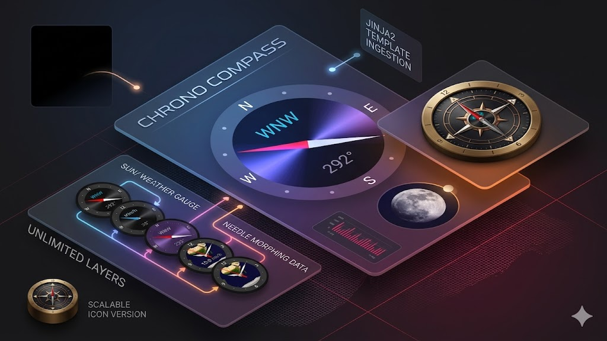

<div align="center">

  [](https://github.com/hacs/integration)
  [](https://www.gnu.org/licenses/agpl-3.0)
  [](https://github.com/rob-vandenberg/chrono-compass-card/releases)

  

  
  
  <p align="center">
    <strong>A precision SVG compass instrument for the Home Assistant Lovelace dashboard.</strong>
  </p>

  <p align="center">
    <a href="#introduction">Introduction</a> •
    <a href="#key-features">Key Features</a> •
    <a href="#visual-showcase">Showcase</a> •
    <a href="#installation">Installation</a> •
    <a href="#configuration">Configuration</a> •
    <a href="#license">License</a>
  </p>

</div>

---

**Chrono Compass Card** is a fully customizable compass card for Home Assistant Lovelace dashboards. All visual elements — the bezel, tick marks, cardinal labels, needle geometry, background image, data fields, etc — are rendered in real time as scalable vector graphics directly in the browser. No fixed sizes. The card is fully responsive and scales cleanly to any dashboard layout.

**Chrono Compass Card**'s primary purpose is directional visualisation: wind direction, sun or moon azimuth, navigation bearings, and similar data. The same rendering engine is capable of other circular instrument configurations, like a clock, a solar system or a gauge, but the compass is the card's core design target.

---

## 📋 Table of Contents

- [Introduction](#introduction)
- [Key Features](#key-features)
- [Visual Showcase](#visual-showcase)
- [Installation](#installation)
  - [HACS (Recommended)](#hacs-recommended)
  - [Manual Installation](#manual-installation)
- [Uninstallation](#uninstallation)
- [Configuration](#configuration)
  - [Main Options](#main-options)
  - [Needle Configuration](#needle-configuration)
  - [Marker Configuration](#marker-configuration)
  - [Tick Marks](#tick-marks)
  - [Cardinal Labels](#cardinal-labels)
  - [Custom Fields](#custom-fields)
  - [Header and Footer](#header-and-footer)
- [License](#license)
- [Support](#support)

---

## 🚀 Key Features

### 🧭 Two Rotation Modes
The card supports two fundamentally different rotation behaviours. In **Needle** mode, the compass dial is fixed and the needle rotates to point to the bearing. In **Dial** mode, the needle always points north and the entire compass dial rotates, so the current direction appears at the top — the same way a ship's compass or aircraft heading indicator behaves. Both modes animate smoothly with configurable transition timing, always taking the shortest arc to the new position.

### 🎨 Fully Programmable Needle Geometry
Needles are generated programmatically using cubic Bézier curves. Four parameters — **Height**, **Width**, **Morph**, and **Curve** — give precise control over needle shape. A standard navigation pointer, a broad wind vane, a symmetrical diamond, or a perfect circle are all achievable by adjusting these values. Multiple needles can be layered simultaneously, each with its own bearing template, colors, and geometry. A two-color gradient is applied along the needle's length for visual depth.

### 🖼️ Background Image with Full Transform Control
Any image — a compass rose, a map, a celestial chart, a custom dial face — can be placed inside the bezel as a background layer. The image supports independent X/Y positioning, scale, and rotation, and can be driven by a Jinja2 template, allowing the image URL itself to change dynamically at runtime.

### 📍 Configurable Tick Mark System
Three independent tiers of tick marks — Primary, Secondary, and Tertiary — each with configurable division count, length, width, color, and radial position. Cardinal labels (N, E, S, W) are rendered separately and can be customized with any text, font size, weight, and color. Tick tiers observe a strict rendering hierarchy: lower tiers are suppressed at angles already occupied by a higher tier, preventing visual overlap.

### 📊 Live Data Fields
Three configurable text fields are rendered inside the bezel, each driven by a Jinja2 template. Fields support independent font size, weight, color, and vertical position. A unit string with its own styling can be appended to each field. The special token `${compass_direction}` resolves client-side to a 16-point compass direction (N, NNE, NE, ENE...) based on the current bearing of needle 1, without any additional HA template subscription.

### 🔗 Native Jinja2 Template Support
Every dynamic value in the card — needle bearings, field text, header and footer text, marker positions, image URLs — accepts a Jinja2 template. Templates are evaluated via Home Assistant's WebSocket connection, so HA manages all entity dependencies and pushes updates automatically. Plain strings are also accepted and resolved without a server round-trip.

### 📐 Pure CSS Scaling
The card scales entirely through CSS container query units (`cqi`). There is no JavaScript resize logic, no pixel calculations, no ResizeObserver. The compass adjusts to any card size automatically and correctly, including in responsive Lovelace layouts.

### 🗺️ Configurable Bezel Shape
The bezel shape is controlled by the `bezel_radius` property (0–50, where 50 is a perfect circle). Values between 0 and 50 produce rounded rectangles, allowing configurations that range from a classic circular compass to a square instrument panel.

---

## 🖼️ Visual Showcase

<div align="center">
  <table>
    <tr>
      <td width="50%">
        <br/>
        <b>Wind Direction Compass</b><br/>
        <sub>Needle points to current wind bearing. Cardinal labels, tick marks, direction text, and degrees field all update in real time.</sub>
      </td>
      <td width="50%">
        <br/>
        <b>Built-in Visual Editor</b><br/>
        <sub>Every property is configurable through the Lovelace UI editor. YAML editing is optional.</sub>
      </td>
    </tr>
    <tr>
      <td width="50%">
        <br/>
        <b>Dial Rotation Mode</b><br/>
        <sub>The compass rose rotates so that the current direction always appears at the top — suitable for navigation and aviation instruments.</sub>
      </td>
      <td width="50%">
        <br/>
        <b>Needle Geometry</b><br/>
        <sub>Height, Width, Morph, and Curve parameters give precise control over needle shape — from a sharp pointer to a broad curved vane or a perfect circle.</sub>
      </td>
    </tr>
    <tr>
      <td width="50%">
        <br/>
        <b>Multiple Needles</b><br/>
        <sub>Any number of needles can be layered on the same compass, each independently configured. Useful for displaying wind direction and gust direction simultaneously.</sub>
      </td>
      <td width="50%">
        <br/>
        <b>Background Image Integration</b><br/>
        <sub>Any image can be placed inside the bezel as a background layer with full transform control. Shown here as a visual showcase of the card's rendering capability.</sub>
      </td>
    </tr>
  </table>
</div>

---

## 📦 Installation

### HACS (Recommended)

1. Open **HACS** in your Home Assistant instance.
2. Navigate to **Frontend** and click the three-dot menu in the top right corner.
3. Select **Custom repositories**.
4. Enter `https://github.com/rob-vandenberg/chrono-compass-card` and select **Lovelace** as the category.
5. Click **Add**. The repository will appear in the list.
6. Search for `Chrono Compass Card` and click **Download**.
7. Reload your browser.

### Manual Installation

1. Download the `chrono-compass-card.js` file from the [latest release](https://github.com/rob-vandenberg/chrono-compass-card/releases).
2. Copy the file to your `/config/www/` directory (create it if it does not exist).
3. Navigate to **Settings > Dashboards > Resources** and add a new resource:
   - **URL:** `/local/chrono-compass-card.js`
   - **Type:** `JavaScript Module`
4. Reload your browser.

> **Note:** The card also ships with a set of sample images (`moon.png`, `sun.png`, `earth.png`, etc.) that can be used as needle or background images. These are located in the `www/` directory of the release and should be copied alongside the `.js` file if you intend to use them.

---

## 🗑️ Uninstallation

To completely remove the Chrono Compass Card:

1. **Remove card instances:** Delete all `custom:chrono-compass-card` entries from your Lovelace dashboards before removing the resource. Leaving orphaned card references in your configuration will produce errors.
2. **Remove the resource:**
   - Navigate to **Settings > Dashboards > Resources** and delete the entry for `chrono-compass-card.js`.
3. **Delete the files:**
   - If installed via **HACS**: Open HACS > Frontend, locate the card, and select **Remove**.
   - If installed **manually**: Delete `chrono-compass-card.js` and any associated image files from your `/config/www/` directory.
4. **Clear the browser cache:** Perform a hard refresh (Ctrl+Shift+R on most browsers) to ensure the cached card definition is fully cleared.

---

## ⚙️ Configuration

The Visual Editor covers the full configuration surface. YAML is only required for properties not yet exposed in the editor, or when scripting dashboard configurations programmatically.

### Main Options

| Attribute | Type | Default | Description |
| :--- | :--- | :--- | :--- |
| `type` | string | **Required** | `custom:chrono-compass-card` |
| `background_color` | string | `#101010` | Background color of the compass interior |
| `bezel_color` | string | `#383838` | Color of the outer bezel ring |
| `bezel_width` | number | `25` | Thickness of the bezel ring, in internal units |
| `bezel_radius` | number | `50` | Corner radius of the bezel (0 = square, 50 = circle). YAML only. |
| `compass_size` | number | `100` | Controls the margin around the compass. Higher values make the compass larger within the card. |
| `compass_rotate` | string | `needle` | `needle` — needle rotates to bearing, dial is fixed. `dial` — dial rotates, needle always points north. |
| `background_image_show` | boolean | `true` | Show or hide the background image |
| `background_image_url` | string | — | URL or Jinja2 template resolving to an image URL |
| `background_image_scale` | number | `100` | Scale of the background image in percent |
| `background_image_x` | number | `0` | Horizontal offset of the background image. Positive = right. |
| `background_image_y` | number | `0` | Vertical offset of the background image. Positive = up. |
| `background_image_rotate` | number | `0` | Rotation of the background image in degrees |
| `rotation_animation_time` | number | `0.5` | Duration of the needle/dial rotation animation in seconds. YAML only. |

### Needle Configuration

Needles are defined as an array under the `needles` key. Multiple needles can be added; they are layered in order with needle 1 on top.

```yaml
needles:
  - name: Wind Direction
    show: true
    template: "{{ state_attr('weather.home', 'wind_bearing') | float(0) }}"
    color_1: '#FF0000'
    color_1_pos: 50
    color_2: '#EEEEEE'
    color_2_pos: 50
    height: 40
    width: 7
    morph: 40
    curve: 0
    position: 0
    invert: false
    rotate: false
```

| Attribute | Type | Default | Description |
| :--- | :--- | :--- | :--- |
| `name` | string | — | Optional label shown in the editor panel header |
| `show` | boolean | `true` | Show or hide this needle |
| `template` | string | Sun azimuth | Jinja2 template or plain number resolving to a bearing in degrees |
| `color_1` | string | `#FF0000` | First color of the needle gradient (tip end) |
| `color_1_pos` | number | `50` | Stop position of color 1 as a percentage of needle length |
| `color_2` | string | `#EEEEEE` | Second color of the needle gradient (tail end) |
| `color_2_pos` | number | `50` | Stop position of color 2 as a percentage of needle length |
| `height` | number | `40` | Length of the needle from tip (P1) to base (P2/P4) in internal units |
| `width` | number | `7` | Width of the needle at its base |
| `morph` | number | `40` | Distance the tail point (P3) extends beyond the base line. Positive = tail below base (standard needle shape). Zero = triangle. Negative = concave tail. |
| `curve` | number | `0` | Roundness of the needle edges. 0 = straight edges. 50 = circular at equal height/morph/width. |
| `position` | number | `0` | Shifts the needle along its axis. Positive = toward north (tip moves up). |
| `invert` | boolean | `false` | Flips the needle vertically — tip and tail swap ends |
| `rotate` | boolean | `false` | Adds 180° to the rotation — points the needle to the opposite bearing |
| `image_show` | boolean | `false` | Replaces the needle path with an image |
| `image_url` | string | — | URL or Jinja2 template resolving to an image URL |
| `image_scale` | number | `100` | Scale of the needle image in percent |
| `image_x` | number | `0` | Horizontal offset of the needle image. Positive = right. |
| `image_y` | number | `0` | Vertical offset of the needle image. Positive = up. |
| `image_rotate` | number | `0` | Rotation of the needle image in degrees |

### Marker Configuration

Markers are fixed triangular indicators anchored at a specific bearing on the compass face. They are defined as an array under the `markers` key and rotate with the compass in Dial mode.

```yaml
markers:
  - show: true
    degrees: '45'
    height: 5
    width: 4
    position: 0
    color: '#FF0000'
    flip: false
```

| Attribute | Type | Default | Description |
| :--- | :--- | :--- | :--- |
| `show` | boolean | `true` | Show or hide this marker |
| `degrees` | string | `0` | Bearing in degrees, or a Jinja2 template resolving to a bearing |
| `height` | number | `5` | Length of the marker triangle |
| `width` | number | `4` | Width of the marker triangle base |
| `position` | number | `0` | Radial offset from the bezel edge. Positive = toward center. |
| `color` | string | `#FF0000` | Fill color of the marker |
| `flip` | boolean | `false` | Flips the marker to point outward instead of inward |

### Tick Marks

Three independent tick tiers are available: Primary (`major`), Secondary (`minor`), and Tertiary (`micro`). Each tier has the following attributes. Replace `major` with `minor` or `micro` for the other tiers.

| Attribute | Type | Default | Description |
| :--- | :--- | :--- | :--- |
| `major_ticks_show` | boolean | `false` | Show or hide primary ticks |
| `major_ticks_divisions` | number | `4` | Number of tick marks around the full circle |
| `major_ticks_length` | number | `6` | Length of each tick mark in internal units |
| `major_ticks_width` | number | `2` | Stroke width of each tick mark |
| `major_ticks_position` | number | `0` | Radial offset from default position. Positive = toward center. |
| `major_ticks_color` | string | `#CCCCCC` | Tick mark color |
| `major_ticks_linecap` | string | `round` | End cap style: `round` or `square` |

> **Tick hierarchy:** Tick marks are suppressed at angles already occupied by a higher tier or by a cardinal label. Primary ticks are always rendered. Secondary and Tertiary ticks are suppressed if their angle coincides with any already-rendered element.

### Cardinal Labels

| Attribute | Type | Default | Description |
| :--- | :--- | :--- | :--- |
| `cardinals_show` | boolean | `true` | Show or hide cardinal labels |
| `cardinal_north` | string | `N` | Text label for north |
| `cardinal_east` | string | `E` | Text label for east |
| `cardinal_south` | string | `S` | Text label for south |
| `cardinal_west` | string | `W` | Text label for west |
| `cardinals_fontsize` | number | `10` | Font size in internal units |
| `cardinals_fontweight` | number | `400` | Font weight |
| `cardinals_position` | number | `0` | Radial offset from default position. Positive = outward. |
| `cardinals_fontcolor` | string | `#EEEEEE` | Label color |

### Custom Fields

Three text fields can be displayed inside the compass. Each is positioned at a fixed base position (field 1 at 25%, field 2 at 50%, field 3 at 75% from the top of the bezel interior) with an adjustable offset.

The special token `${compass_direction}` can be used in any field template to display the 16-point compass direction derived from needle 1's current bearing (e.g. N, NNE, NE, ENE...). This token is resolved client-side and does not require an additional HA template subscription.

| Attribute | Type | Default | Description |
| :--- | :--- | :--- | :--- |
| `field_1_show` | boolean | `true` | Show or hide field 1 |
| `field_1_template` | string | `${compass_direction}` | Jinja2 template or plain text. `${compass_direction}` resolves to the 16-point direction of needle 1. |
| `field_1_fontsize` | number | `1.8` | Font size multiplier |
| `field_1_fontweight` | number | `400` | Font weight |
| `field_1_position` | number | `0` | Vertical offset from base position. Positive = up. |
| `field_1_fontcolor` | string | `#29B6CF` | Text color |
| `field_1_unit` | string | — | Unit string appended after the field value |
| `field_1_unit_fontsize` | number | `1.4` | Font size multiplier for the unit |
| `field_1_unit_fontweight` | number | `400` | Font weight for the unit |
| `field_1_unit_fontcolor` | string | `#196D7C` | Color of the unit text |

Fields 2 and 3 follow the same attribute pattern with `field_2_` and `field_3_` prefixes.

### Header and Footer

A header and footer text element can be displayed in the margin above and below the compass, respectively. Both support Jinja2 templates and the literal string `<br>` for line breaks.

| Attribute | Type | Default | Description |
| :--- | :--- | :--- | :--- |
| `header_show` | boolean | `false` | Show or hide the header |
| `header_text` | string | `header` | Text or Jinja2 template |
| `header_fontsize` | number | `1.0` | Font size in em units |
| `header_fontweight` | number | `400` | Font weight |
| `header_position` | number | `0` | Vertical offset. Positive = up. |
| `header_fontcolor` | string | `#FFFFFF` | Text color |
| `footer_show` | boolean | `false` | Show or hide the footer |
| `footer_text` | string | `footer` | Text or Jinja2 template |
| `footer_fontsize` | number | `1.0` | Font size in em units |
| `footer_fontweight` | number | `400` | Font weight |
| `footer_position` | number | `0` | Vertical offset. Positive = up. |
| `footer_fontcolor` | string | `#FFFFFF` | Text color |

---

## ⚖️ License

**GNU Affero General Public License v3.0 (AGPL-3.0)**

This project is licensed under the AGPL-3.0. You are free to use, modify, and distribute this software, provided that any modifications or derivative works that are made available — including over a network — are also distributed under the same license.

Full license text: [https://www.gnu.org/licenses/agpl-3.0](https://www.gnu.org/licenses/agpl-3.0)

Copyright © 2026 Rob Vandenberg. All rights reserved.

---

## ☕ Support

If you find this project useful and wish to support its continued development, please consider a contribution.

[](https://www.buymeacoffee.com/robvandenberg)
