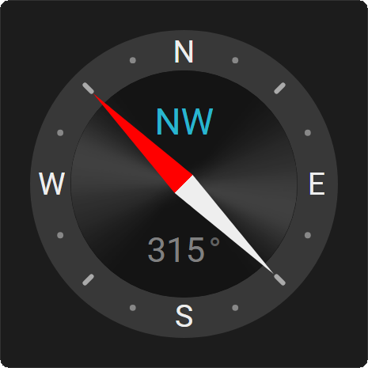
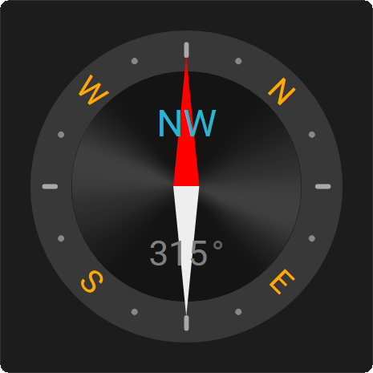
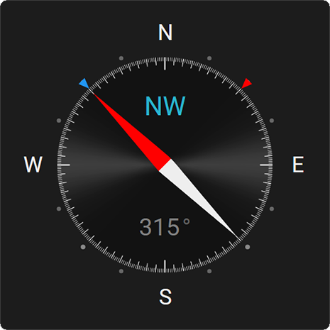
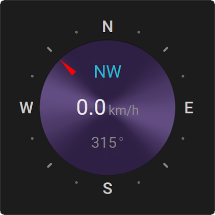
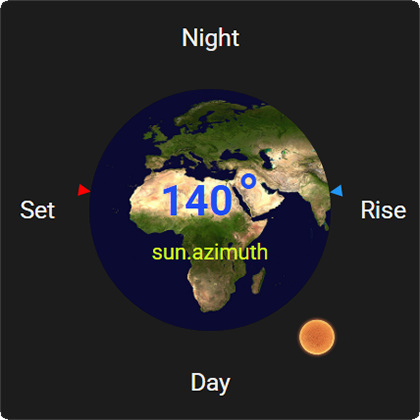
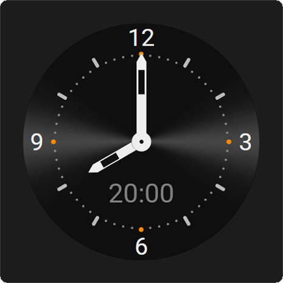
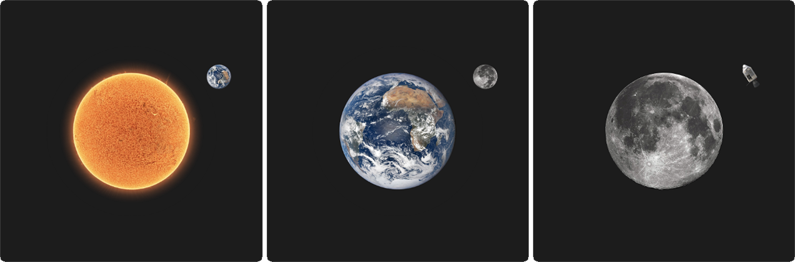
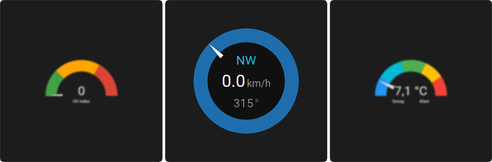
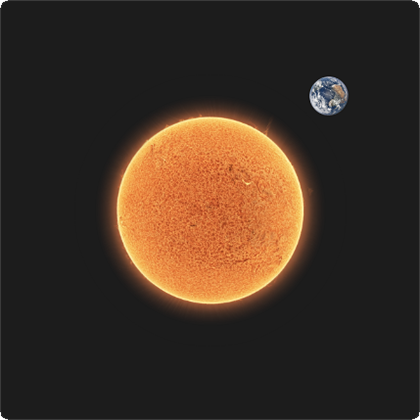
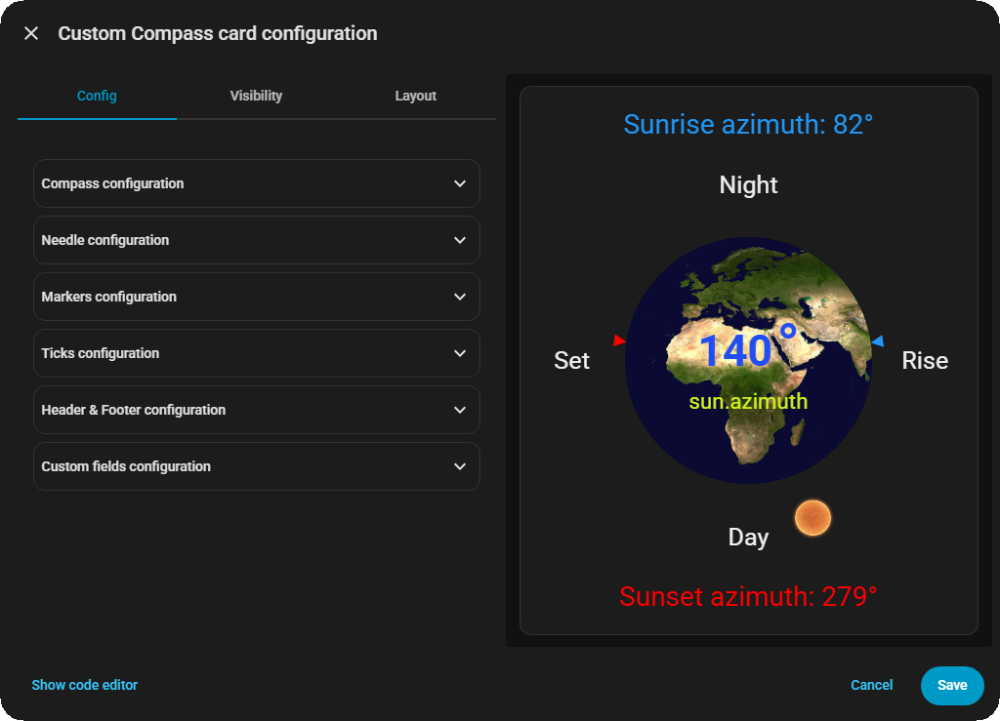

# Chrono Compass Card

### A fully configurable compass card for Home Assistant

[](https://github.com/rob-vandenberg/chrono-compass-card/releases)
[](https://github.com/hacs/integration)
[](https://www.gnu.org/licenses/agpl-3.0)

---

A compass card that doesn't just point north — it points wherever you tell it to. Wind direction, sun azimuth, moon position, vehicle heading, solar panel orientation — if it has a bearing, Chrono Compass Card can show it.

But what makes this card different isn't what it can display. It's how it looks doing it.

The needle is not a fixed arrow. It's a parametric shape you control: morph it from a sharp triangle into a classic diamond needle, a smooth teardrop, a perfect circle, or a wide kite. Add curvature to the edges. Give it a two-color gradient. Replace it entirely with your own image. Stack multiple needles on the same dial. Rotate the dial instead of the needle. Add tick marks, cardinal labels, markers, text fields, a header, a footer.

Everything is configurable through the built-in visual editor. No YAML required — unless you want to.

---

## Gallery

<table>
<thead>
<tr>
<th align="left" width="33%">Classic Compass</th>
<th align="left" width="33%">Heading Indicator</th>
<th align="left" width="33%">Wind Speed &amp; Direction</th>
</tr>
</thead>
<tbody>
<tr>
<td>

<details>
<summary>📋 Copy this configuration</summary>

```yaml
type: custom:chrono-compass-card
background_color: "#101010"
bezel_color: "#383838"
bezel_width: 16
bezel_size: 0
background_image_show: true
background_image_url: /local/community/chrono-compass-card/black.png
background_image_scale: 100
background_image_x: 0
background_image_y: 0
background_image_rotate: 0
needles:
  - name: ""
    show: true
    template: "{{ state_attr('sun.sun', 'azimuth') | float(0) }}"
    invert: false
    rotate: false
    color_1: "#FF0000"
    color_1_pos: 50
    color_2: "#EEEEEE"
    color_2_pos: 50
    height: 100
    width: 10
    position: -10
    morph: 50
    curve: 0
    image_show: false
    image_url: /local/community/chrono-compass-card/moon.png
    image_scale: 100
    image_x: 0
    image_y: 0
    image_rotate: 0
compass_rotate: false
markers: []
cardinals_show: true
cardinal_north: "N"
cardinal_east: E
cardinal_south: S
cardinal_west: W
cardinals_fontsize: 10
cardinals_fontweight: 400
cardinals_position: 1.5
cardinals_fontcolor: "#EEEEEE"
major_ticks_show: false
minor_ticks_show: true
minor_ticks_divisions: 8
minor_ticks_length: 3
minor_ticks_width: 1.5
minor_ticks_position: -4.5
minor_ticks_color: "#AAAAAA"
micro_ticks_show: true
micro_ticks_divisions: 16
micro_ticks_length: 0
micro_ticks_width: 2
micro_ticks_position: -6.5
micro_ticks_color: "#888888"
header_show: false
footer_show: false
field_1_show: true
field_1_template: ${compass_direction}
field_1_fontsize: 1.5
field_1_fontweight: 400
field_1_position: 23
field_1_fontcolor: "#29B6CF"
field_1_unit: ""
field_2_show: false
field_3_show: true
field_3_template: "{{ state_attr('sun.sun', 'azimuth') | round(0) }}"
field_3_unit: "°"
field_3_fontsize: 1.4
field_3_fontweight: 400
field_3_position: 79
field_3_fontcolor: "#808080"
field_3_unit_fontsize: 1.4
field_3_unit_fontweight: 400
field_3_unit_fontcolor: "#606060"
rotation_animation_time: 0.5
```

</details>

A clean, timeless compass rose. Cardinal labels, three tiers of tick marks, and a single needle tracking sun azimuth.
</td>
<td>

<details>
<summary>📋 Copy this configuration</summary>

```yaml
type: custom:chrono-compass-card
background_color: "#101010"
bezel_color: "#383838"
bezel_width: 16
bezel_size: 0
background_image_show: true
background_image_url: /local/community/chrono-compass-card/black.png
background_image_scale: 100
background_image_x: 0
background_image_y: 0
background_image_rotate: 0
needles:
  - name: ""
    show: true
    template: "{{ state_attr('sun.sun', 'azimuth') | float(0) }}"
    invert: false
    rotate: false
    color_1: "#FF0000"
    color_1_pos: 50
    color_2: "#EEEEEE"
    color_2_pos: 50
    height: 100
    width: 10
    position: -10
    morph: 50
    curve: 0
    image_show: false
    image_url: /local/community/chrono-compass-card/moon.png
    image_scale: 100
    image_x: 0
    image_y: 0
    image_rotate: 0
compass_rotate: true
markers: []
cardinals_show: true
cardinal_north: "N"
cardinal_east: E
cardinal_south: S
cardinal_west: W
cardinals_fontsize: 10
cardinals_fontweight: 400
cardinals_position: 1.5
cardinals_fontcolor: "#EEEEEE"
major_ticks_show: false
minor_ticks_show: true
minor_ticks_divisions: 8
minor_ticks_length: 3
minor_ticks_width: 1.5
minor_ticks_position: -4.5
minor_ticks_color: "#AAAAAA"
micro_ticks_show: true
micro_ticks_divisions: 16
micro_ticks_length: 0
micro_ticks_width: 2
micro_ticks_position: -6.5
micro_ticks_color: "#888888"
header_show: false
footer_show: false
field_1_show: true
field_1_template: ${compass_direction}
field_1_fontsize: 1.5
field_1_fontweight: 400
field_1_position: 23
field_1_fontcolor: "#29B6CF"
field_1_unit: ""
field_2_show: false
field_3_show: true
field_3_template: "{{ state_attr('sun.sun', 'azimuth') | round(0) }}"
field_3_unit: "°"
field_3_fontsize: 1.4
field_3_fontweight: 400
field_3_position: 79
field_3_fontcolor: "#808080"
field_3_unit_fontsize: 1.4
field_3_unit_fontweight: 400
field_3_unit_fontcolor: "#606060"
rotation_animation_time: 0.5
```

</details>

The needle stays fixed at north. The dial rotates beneath it — exactly like a cockpit heading indicator. Use this mode when your sensor reports a heading rather than a direction.
</td>
<td>

<details>
<summary>📋 Copy this configuration</summary>

```yaml
type: custom:chrono-compass-card
background_color: "#101010"
bezel_color: "#383838"
bezel_width: 16
bezel_size: 0
background_image_show: true
background_image_url: /local/community/chrono-compass-card/black.png
background_image_scale: 100
background_image_x: 0
background_image_y: 0
background_image_rotate: 0
needles:
  - name: "Wind direction"
    show: true
    template: "{{ states('sensor.wind_bearing') | float(0) }}"
    invert: false
    rotate: false
    color_1: "#FF0000"
    color_1_pos: 50
    color_2: "#EEEEEE"
    color_2_pos: 50
    height: 100
    width: 10
    position: -10
    morph: 50
    curve: 0
    image_show: false
    image_url: /local/community/chrono-compass-card/moon.png
    image_scale: 100
    image_x: 0
    image_y: 0
    image_rotate: 0
  - name: "Wind gust"
    show: true
    template: "{{ states('sensor.wind_gust_bearing') | float(0) }}"
    invert: false
    rotate: false
    color_1: "#2196F3"
    color_1_pos: 50
    color_2: "#90CAF9"
    color_2_pos: 50
    height: 80
    width: 8
    position: -10
    morph: 50
    curve: 0
    image_show: false
    image_url: /local/community/chrono-compass-card/moon.png
    image_scale: 100
    image_x: 0
    image_y: 0
    image_rotate: 0
compass_rotate: false
markers: []
cardinals_show: true
cardinal_north: "N"
cardinal_east: E
cardinal_south: S
cardinal_west: W
cardinals_fontsize: 10
cardinals_fontweight: 400
cardinals_position: 1.5
cardinals_fontcolor: "#EEEEEE"
major_ticks_show: false
minor_ticks_show: true
minor_ticks_divisions: 8
minor_ticks_length: 3
minor_ticks_width: 1.5
minor_ticks_position: -4.5
minor_ticks_color: "#AAAAAA"
micro_ticks_show: true
micro_ticks_divisions: 16
micro_ticks_length: 0
micro_ticks_width: 2
micro_ticks_position: -6.5
micro_ticks_color: "#888888"
header_show: false
footer_show: false
field_1_show: true
field_1_template: ${compass_direction}
field_1_fontsize: 1.5
field_1_fontweight: 400
field_1_position: 23
field_1_fontcolor: "#29B6CF"
field_1_unit: ""
field_2_show: true
field_2_template: "{{ states('sensor.ws_wind_speed') | round(1) }}"
field_2_unit: km/h
field_2_fontsize: 2
field_2_fontweight: 400
field_2_position: 50
field_2_fontcolor: "#E8E8E8"
field_2_unit_fontsize: 1.2
field_2_unit_fontweight: 400
field_2_unit_fontcolor: "#8C8C8C"
field_3_show: true
field_3_template: "{{ states('sensor.wind_bearing') | round(0) }}"
field_3_unit: "°"
field_3_fontsize: 1.4
field_3_fontweight: 400
field_3_position: 79
field_3_fontcolor: "#808080"
field_3_unit_fontsize: 1.4
field_3_unit_fontweight: 400
field_3_unit_fontcolor: "#606060"
rotation_animation_time: 0.5
```

</details>

Two needles, two sensors — wind direction and wind gust on the same dial, with live wind speed in the center field.
</td>
</tr>
<tr>
<th align="left" width="33%">Sun Tracker</th>
<th align="left" width="33%">Custom Markers</th>
<th align="left" width="33%">Analog Clock</th>
</tr>
<tr>
<td>

<details>
<summary>📋 Copy this configuration</summary>

```yaml
type: custom:chrono-compass-card
background_color: "#101010"
bezel_color: "#383838"
bezel_width: 16
bezel_size: 0
background_image_show: true
background_image_url: /local/community/chrono-compass-card/earth.png
background_image_scale: 100
background_image_x: 0
background_image_y: 0
background_image_rotate: 0
needles:
  - name: "Sun"
    show: true
    template: "{{ state_attr('sun.sun', 'azimuth') | float(0) }}"
    invert: false
    rotate: false
    color_1: "#FFD700"
    color_1_pos: 50
    color_2: "#FFF9C4"
    color_2_pos: 50
    height: 100
    width: 10
    position: -10
    morph: 50
    curve: 27.6
    image_show: true
    image_url: /local/community/chrono-compass-card/sun.png
    image_scale: 100
    image_x: 0
    image_y: 0
    image_rotate: 0
compass_rotate: false
markers: []
cardinals_show: true
cardinal_north: "N"
cardinal_east: E
cardinal_south: S
cardinal_west: W
cardinals_fontsize: 10
cardinals_fontweight: 400
cardinals_position: 1.5
cardinals_fontcolor: "#EEEEEE"
major_ticks_show: false
minor_ticks_show: true
minor_ticks_divisions: 8
minor_ticks_length: 3
minor_ticks_width: 1.5
minor_ticks_position: -4.5
minor_ticks_color: "#AAAAAA"
micro_ticks_show: true
micro_ticks_divisions: 16
micro_ticks_length: 0
micro_ticks_width: 2
micro_ticks_position: -6.5
micro_ticks_color: "#888888"
header_show: false
footer_show: false
field_1_show: true
field_1_template: ${compass_direction}
field_1_fontsize: 1.5
field_1_fontweight: 400
field_1_position: 23
field_1_fontcolor: "#29B6CF"
field_1_unit: ""
field_2_show: false
field_3_show: true
field_3_template: "{{ state_attr('sun.sun', 'azimuth') | round(0) }}"
field_3_unit: "°"
field_3_fontsize: 1.4
field_3_fontweight: 400
field_3_position: 79
field_3_fontcolor: "#808080"
field_3_unit_fontsize: 1.4
field_3_unit_fontweight: 400
field_3_unit_fontcolor: "#606060"
rotation_animation_time: 0.5
```

</details>

The Earth as a background image, a sun icon sweeping across it. Uses the bundled earth.png and sun.png images.
</td>
<td>

<details>
<summary>📋 Copy this configuration</summary>

```yaml
type: custom:chrono-compass-card
background_color: "#101010"
bezel_color: "#383838"
bezel_width: 16
bezel_size: 0
background_image_show: true
background_image_url: /local/community/chrono-compass-card/black.png
background_image_scale: 100
background_image_x: 0
background_image_y: 0
background_image_rotate: 0
needles:
  - name: ""
    show: true
    template: "{{ state_attr('sun.sun', 'azimuth') | float(0) }}"
    invert: false
    rotate: false
    color_1: "#FF0000"
    color_1_pos: 50
    color_2: "#EEEEEE"
    color_2_pos: 50
    height: 100
    width: 10
    position: -10
    morph: 50
    curve: 0
    image_show: false
    image_url: /local/community/chrono-compass-card/moon.png
    image_scale: 100
    image_x: 0
    image_y: 0
    image_rotate: 0
compass_rotate: false
markers:
  - show: true
    degrees: "30"
    height: 5
    width: 4
    position: 0
    color: "#FF0000"
    flip: false
  - show: true
    degrees: "210"
    height: 5
    width: 4
    position: 0
    color: "#2196F3"
    flip: false
cardinals_show: true
cardinal_north: "N"
cardinal_east: E
cardinal_south: S
cardinal_west: W
cardinals_fontsize: 10
cardinals_fontweight: 400
cardinals_position: 1.5
cardinals_fontcolor: "#EEEEEE"
major_ticks_show: false
minor_ticks_show: true
minor_ticks_divisions: 8
minor_ticks_length: 3
minor_ticks_width: 1.5
minor_ticks_position: -4.5
minor_ticks_color: "#AAAAAA"
micro_ticks_show: true
micro_ticks_divisions: 16
micro_ticks_length: 0
micro_ticks_width: 2
micro_ticks_position: -6.5
micro_ticks_color: "#888888"
header_show: false
footer_show: false
field_1_show: true
field_1_template: ${compass_direction}
field_1_fontsize: 1.5
field_1_fontweight: 400
field_1_position: 23
field_1_fontcolor: "#29B6CF"
field_1_unit: ""
field_2_show: false
field_3_show: true
field_3_template: "{{ state_attr('sun.sun', 'azimuth') | round(0) }}"
field_3_unit: "°"
field_3_fontsize: 1.4
field_3_fontweight: 400
field_3_position: 79
field_3_fontcolor: "#808080"
field_3_unit_fontsize: 1.4
field_3_unit_fontweight: 400
field_3_unit_fontcolor: "#606060"
rotation_animation_time: 0.5
```

</details>

Fixed reference markers on the bezel — ideal for a target wind angle, a solar panel orientation, or any fixed bearing to compare against.
</td>
<td>

<details>
<summary>📋 Copy this configuration</summary>

```yaml
type: custom:chrono-compass-card
background_color: "#101010"
bezel_color: "#383838"
bezel_width: 16
bezel_size: 0
background_image_show: true
background_image_url: /local/community/chrono-compass-card/black.png
background_image_scale: 100
background_image_x: 0
background_image_y: 0
background_image_rotate: 0
needles:
  - name: "Hours"
    show: true
    template: "{{ (now().hour % 12) * 30 + now().minute * 0.5 }}"
    invert: false
    rotate: false
    color_1: "#FFFFFF"
    color_1_pos: 50
    color_2: "#AAAAAA"
    color_2_pos: 50
    height: 60
    width: 10
    position: -10
    morph: 50
    curve: 0
    image_show: false
    image_url: /local/community/chrono-compass-card/moon.png
    image_scale: 100
    image_x: 0
    image_y: 0
    image_rotate: 0
  - name: "Minutes"
    show: true
    template: "{{ now().minute * 6 }}"
    invert: false
    rotate: false
    color_1: "#CCCCCC"
    color_1_pos: 50
    color_2: "#888888"
    color_2_pos: 50
    height: 85
    width: 6
    position: -10
    morph: 50
    curve: 0
    image_show: false
    image_url: /local/community/chrono-compass-card/moon.png
    image_scale: 100
    image_x: 0
    image_y: 0
    image_rotate: 0
  - name: "Seconds"
    show: true
    template: "{{ now().second * 6 }}"
    invert: false
    rotate: false
    color_1: "#FF0000"
    color_1_pos: 50
    color_2: "#FF0000"
    color_2_pos: 50
    height: 95
    width: 2
    position: -10
    morph: 50
    curve: 0
    image_show: false
    image_url: /local/community/chrono-compass-card/moon.png
    image_scale: 100
    image_x: 0
    image_y: 0
    image_rotate: 0
compass_rotate: false
markers: []
cardinals_show: false
major_ticks_show: true
major_ticks_divisions: 12
major_ticks_length: 6
major_ticks_width: 2
major_ticks_position: -3.5
major_ticks_color: "#CCCCCC"
minor_ticks_show: true
minor_ticks_divisions: 60
minor_ticks_length: 3
minor_ticks_width: 1
minor_ticks_position: -4.5
minor_ticks_color: "#666666"
micro_ticks_show: false
header_show: false
footer_show: false
field_1_show: false
field_2_show: false
field_3_show: false
rotation_animation_time: 0.5
```

</details>

Three needles doing math — hours, minutes, and seconds each driven by a Jinja2 template. No special clock mode needed.
</td>
</tr>
<tr>
<th align="left" width="33%">Space — ISS Tracker</th>
<th align="left" width="33%">Dashboard Panel</th>
<th align="left" width="33%">Moon Tracker</th>
</tr>
<tr>
<td>

<details>
<summary>📋 Copy this configuration</summary>

```yaml
type: custom:chrono-compass-card
background_color: "#000000"
bezel_color: "#1A1A2E"
bezel_width: 16
bezel_size: 0
background_image_show: true
background_image_url: /local/community/chrono-compass-card/world.png
background_image_scale: 100
background_image_x: 0
background_image_y: 0
background_image_rotate: 0
needles:
  - name: "ISS"
    show: true
    template: "{{ state_attr('sun.sun', 'azimuth') | float(0) }}"
    invert: false
    rotate: false
    color_1: "#FF0000"
    color_1_pos: 50
    color_2: "#EEEEEE"
    color_2_pos: 50
    height: 100
    width: 10
    position: -10
    morph: 50
    curve: 27.6
    image_show: true
    image_url: /local/community/chrono-compass-card/iss.png
    image_scale: 100
    image_x: 0
    image_y: 0
    image_rotate: 0
compass_rotate: false
markers: []
cardinals_show: true
cardinal_north: "N"
cardinal_east: E
cardinal_south: S
cardinal_west: W
cardinals_fontsize: 10
cardinals_fontweight: 400
cardinals_position: 1.5
cardinals_fontcolor: "#EEEEEE"
major_ticks_show: false
minor_ticks_show: true
minor_ticks_divisions: 8
minor_ticks_length: 3
minor_ticks_width: 1.5
minor_ticks_position: -4.5
minor_ticks_color: "#333366"
micro_ticks_show: false
header_show: false
footer_show: false
field_1_show: true
field_1_template: ${compass_direction}
field_1_fontsize: 1.5
field_1_fontweight: 400
field_1_position: 23
field_1_fontcolor: "#29B6CF"
field_1_unit: ""
field_2_show: false
field_3_show: false
rotation_animation_time: 0.5
```

</details>

A world map background with the ISS image as the needle. Uses the bundled world.png and iss.png images.
</td>
<td>

<details>
<summary>📋 Copy this configuration</summary>

```yaml
type: custom:chrono-compass-card
background_color: "#101010"
bezel_color: "#383838"
bezel_width: 16
bezel_size: 0
background_image_show: true
background_image_url: /local/community/chrono-compass-card/black.png
background_image_scale: 100
background_image_x: 0
background_image_y: 0
background_image_rotate: 0
needles:
  - name: ""
    show: true
    template: "{{ state_attr('sun.sun', 'azimuth') | float(0) }}"
    invert: false
    rotate: false
    color_1: "#FF0000"
    color_1_pos: 50
    color_2: "#EEEEEE"
    color_2_pos: 50
    height: 100
    width: 10
    position: -10
    morph: 50
    curve: 0
    image_show: false
    image_url: /local/community/chrono-compass-card/moon.png
    image_scale: 100
    image_x: 0
    image_y: 0
    image_rotate: 0
compass_rotate: false
markers: []
cardinals_show: true
cardinal_north: "N"
cardinal_east: E
cardinal_south: S
cardinal_west: W
cardinals_fontsize: 10
cardinals_fontweight: 400
cardinals_position: 1.5
cardinals_fontcolor: "#EEEEEE"
major_ticks_show: false
minor_ticks_show: true
minor_ticks_divisions: 8
minor_ticks_length: 3
minor_ticks_width: 1.5
minor_ticks_position: -4.5
minor_ticks_color: "#AAAAAA"
micro_ticks_show: false
header_show: true
header_text: "Sun Azimuth"
header_fontsize: 1.2
header_fontweight: 400
header_position: 0
header_fontcolor: "#888888"
footer_show: false
field_1_show: true
field_1_template: ${compass_direction}
field_1_fontsize: 1.5
field_1_fontweight: 400
field_1_position: 23
field_1_fontcolor: "#29B6CF"
field_1_unit: ""
field_2_show: false
field_3_show: true
field_3_template: "{{ state_attr('sun.sun', 'azimuth') | round(0) }}"
field_3_unit: "°"
field_3_fontsize: 1.4
field_3_fontweight: 400
field_3_position: 79
field_3_fontcolor: "#808080"
field_3_unit_fontsize: 1.4
field_3_unit_fontweight: 400
field_3_unit_fontcolor: "#606060"
rotation_animation_time: 0.5
```

</details>

Compact and minimal with a header label. Designed to sit alongside other cards in a dense dashboard layout.
</td>
<td>

<details>
<summary>📋 Copy this configuration</summary>

```yaml
type: custom:chrono-compass-card
background_color: "#101010"
bezel_color: "#383838"
bezel_width: 16
bezel_size: 0
background_image_show: true
background_image_url: /local/community/chrono-compass-card/black.png
background_image_scale: 100
background_image_x: 0
background_image_y: 0
background_image_rotate: 0
needles:
  - name: "Moon"
    show: true
    template: "{{ state_attr('sun.sun', 'azimuth') | float(0) }}"
    invert: false
    rotate: false
    color_1: "#CCCCCC"
    color_1_pos: 50
    color_2: "#888888"
    color_2_pos: 50
    height: 100
    width: 10
    position: -10
    morph: 50
    curve: 27.6
    image_show: true
    image_url: /local/community/chrono-compass-card/moon.png
    image_scale: 100
    image_x: 0
    image_y: 0
    image_rotate: 0
compass_rotate: false
markers: []
cardinals_show: true
cardinal_north: "N"
cardinal_east: E
cardinal_south: S
cardinal_west: W
cardinals_fontsize: 10
cardinals_fontweight: 400
cardinals_position: 1.5
cardinals_fontcolor: "#EEEEEE"
major_ticks_show: false
minor_ticks_show: true
minor_ticks_divisions: 8
minor_ticks_length: 3
minor_ticks_width: 1.5
minor_ticks_position: -4.5
minor_ticks_color: "#AAAAAA"
micro_ticks_show: true
micro_ticks_divisions: 16
micro_ticks_length: 0
micro_ticks_width: 2
micro_ticks_position: -6.5
micro_ticks_color: "#888888"
header_show: false
footer_show: false
field_1_show: true
field_1_template: ${compass_direction}
field_1_fontsize: 1.5
field_1_fontweight: 400
field_1_position: 23
field_1_fontcolor: "#29B6CF"
field_1_unit: ""
field_2_show: false
field_3_show: true
field_3_template: "{{ state_attr('sun.sun', 'azimuth') | round(0) }}"
field_3_unit: "°"
field_3_fontsize: 1.4
field_3_fontweight: 400
field_3_position: 79
field_3_fontcolor: "#808080"
field_3_unit_fontsize: 1.4
field_3_unit_fontweight: 400
field_3_unit_fontcolor: "#606060"
rotation_animation_time: 0.5
```

</details>

The moon image as a needle, tracking azimuth across a dark sky dial. Uses the bundled moon.png image.
</td>
</tr>
</tbody>
</table>

---

## Visual Editor

Everything you see above was created without writing a single line of YAML. The built-in visual editor covers every configuration option.

<table>
<tr>
<td></td>
<td valign="middle">
<p>The editor opens when you click the pencil icon on any Chrono Compass Card. Every option you see in this README is accessible here — no YAML required.</p>
<p>The editor is organized into collapsible panels: <b>Compass configuration</b>, <b>Needle configuration</b>, <b>Markers configuration</b>, <b>Ticks configuration</b>, <b>Header &amp; Footer</b>, and <b>Custom fields</b>.</p>
<p>Each needle gets its own sub-panel inside the Needle section. Add as many needles as you need with the <b>+ Add needle</b> button. Markers work the same way.</p>
<p>Color fields show a color picker and a hex input side by side — you can type any <code>#RRGGBB</code> or <code>#RRGGBBAA</code> value directly.</p>
</td>
</tr>
</table>

---

## Installation

### Via HACS (recommended)

1. Open HACS in your Home Assistant
2. Click the three dots menu in the top right → **Custom repositories**
3. Add `https://github.com/rob-vandenberg/chrono-compass-card` and select type **Dashboard**
4. Click **Add**, then search for **Chrono Compass Card**
5. Click **Download** and reload when prompted

### Manual installation

1. Download `chrono-compass-card.js` from the [latest release](https://github.com/rob-vandenberg/chrono-compass-card/releases)
2. Copy it to `/config/www/chrono-compass-card/`
3. Add it to your dashboard resources:

```yaml
resources:
  - url: /local/chrono-compass-card/chrono-compass-card.js
    type: module
```

4. Reload Home Assistant

---

## Your first compass in 60 seconds

Add a new card to any Lovelace dashboard, switch to the code editor, and paste this:

```yaml
type: custom:chrono-compass-card
```

That's it. The card appears immediately, showing the sun's azimuth with default settings. Click the pencil icon to open the visual editor and start exploring.

---

## How it works — a guided tour

Rather than throwing every option at you at once, let's build something step by step. By the end of this section you'll understand how all the pieces fit together.

### The compass circle

The circular dial is the foundation of the card. Two properties control its appearance directly:

- **Background color** — the fill color of the disc. Defaults to near-black `#101010`. Supports `#RRGGBBAA` for transparency.
- **Bezel color** — the border ring around the disc. Defaults to dark grey `#383838`.
- **Bezel width** — how thick the border ring is.
- **Bezel size** — shifts the outer edge of the card inward or outward, giving you fine control over how much of the card the compass fills.

You can also replace the background color with an image — a map, the NASA Blue Marble, a custom graphic. The background image has its own position, scale, and rotation controls.

### Needles

A needle is what points at your bearing. You can have as many needles as you want — one for wind direction, one for wind gust, one for sun azimuth, all on the same dial.

Each needle is driven by a **Jinja2 template** that must resolve to a number between 0 and 360:

```yaml
needles:
  - template: "{{ state_attr('sun.sun', 'azimuth') | float(0) }}"
```

That's the minimum for a working needle. Everything else has a sensible default.

#### Needle shape

Two parameters define what the needle looks like:

**Morph** moves the tail of the needle:

| Value | What you get |
|-------|-------------|
| `0` | A flat triangle — sharp and minimal |
| negative | A notched arrow — the tail is cut inward |
| `50` | A classic diamond needle — tip and tail are symmetric |
| `> 50` | A kite shape — the tail fans outward |

**Curve** adds Bézier curvature to all four edges:

| Value | What you get |
|-------|-------------|
| `0` | Straight edges |
| `10–20` | Softly rounded |
| `27.6` | A perfect circle (when combined with `morph: 50` and equal width and height) |
| `50+` | Heavy bulge — great for crescent shapes |

> **Pro tip:** To create a perfect circle for a sun or moon dot — set `morph: 50`, `curve: 27.6`, and make `width` and `height` equal.

#### Needle image

Instead of the gradient shape, you can display your own image clipped to the needle's outline. Set `image_show: true` and point `image_url` at any image accessible to Home Assistant. The bundled images in `/local/community/chrono-compass-card/` include `sun.png`, `moon.png`, `iss.png`, `earth.png`, `world.png`, `apollo.png`, and others.

#### Multiple needles

Add as many needles as you need. The first needle in the list renders on top:

```yaml
needles:
  - name: "Wind direction"
    template: "{{ states('sensor.wind_bearing') | float(0) }}"
    color_1: "#FF0000"
  - name: "Wind gust"
    template: "{{ states('sensor.wind_gust_bearing') | float(0) }}"
    color_1: "#2196F3"
    height: 80
```

### Compass rotation mode

By default the dial is fixed and the needles rotate. Enabling `compass_rotate: true` flips this: needle 1 stays fixed pointing north and the entire dial — ticks, markers, cardinal labels — rotates beneath it.

This is the correct mode when your sensor reports a **heading** rather than a **direction**. A vehicle heading of 270° means the vehicle is pointing west. In rotation mode, the dial rotates so that west faces the fixed needle — exactly like an aircraft heading indicator or a nautical chart compass.

### Tick marks

Three independent tiers of tick marks sit on the bezel ring:

- **Primary** — the main divisions. Defaults to 4 (one per cardinal point).
- **Secondary** — the intermediate divisions. Defaults to 8.
- **Tertiary** — the finest divisions. Defaults to 16.

Each tier has its own toggle, position, length, width, and color. The number of divisions is configurable — set primary to 12 and you have a clock face; set it to 36 and you have a 10° scale.

Higher-priority tiers take precedence over lower ones — a secondary tick is never drawn on top of a primary tick position. This keeps the bezel clean no matter how many tiers you enable.

### Cardinal labels

Enable `cardinals_show: true` to display N, E, S, W labels on the dial. The labels are fully configurable — set them to any text you want. Dutch users can display N, O, Z, W. German users N, O, S, W.

The 16-point compass direction shown in the text fields is automatically derived from your four cardinal letters — so if you change East to O, then NNE becomes NNO, and so on.

Cardinal labels and primary tick marks can both be enabled at the same time. They render independently.

### Markers

Markers are small triangles that sit on the bezel ring at a fixed bearing. They're useful for reference points — a target wind angle, a solar panel orientation, a waypoint.

```yaml
markers:
  - show: true
    degrees: "180"
    color: "#FF0000"
```

The `degrees` field supports Jinja2 templates, so a marker can track a dynamic bearing from a sensor. Markers live on the same layer as the tick marks, so in `compass_rotate` mode they rotate with the dial — which is exactly correct for a fixed real-world bearing.

The `flip` option reverses the triangle so it points outward instead of inward.

### Text fields

Three text fields float inside the compass at positions you control. Each field has a value and an optional unit, with independent styling for both.

The special token `${compass_direction}` converts the current bearing of needle 1 into a 16-point compass direction — N, NNE, NE, ENE, E, and so on — using your configured cardinal letters:

```yaml
field_1_template: "${compass_direction}"
```

Standard Jinja2 works too:

```yaml
field_2_template: "{{ states('sensor.wind_speed') | round(1) }}"
field_2_unit: "km/h"
```

Position is a percentage of the compass height — `23` puts the field near the top, `50` in the center, `79` near the bottom.

### Header and footer

An optional header and footer appear above and below the compass circle. When hidden they take up no space — the card stays perfectly square. When shown, the card grows to accommodate them. Both support Jinja2 templates.

### Animation

Every rotation — needle or dial — animates smoothly. The animation always takes the shortest arc, so a change from 359° to 1° moves 2° counterclockwise rather than sweeping 358° the long way. This matters especially for wind direction, which can jump by large amounts rapidly.

The default transition duration is 0.5 seconds. Change it with `rotation_animation_time`.

---

## Full configuration reference

### Compass

| Option | Default | Description |
|--------|---------|-------------|
| `background_color` | `#101010` | Compass circle fill color. Supports `#RRGGBBAA` |
| `bezel_color` | `#383838` | Border ring color. Supports `#RRGGBBAA` |
| `bezel_width` | `16` | Border ring thickness |
| `bezel_size` | `0` | Outer boundary adjustment. Positive = larger, negative = smaller |
| `background_image_show` | `true` | Show a background image inside the compass circle |
| `background_image_url` | `black.png` | URL of the background image. Supports Jinja2 |
| `background_image_scale` | `100` | Image scale as a percentage |
| `background_image_x` | `0` | Horizontal offset |
| `background_image_y` | `0` | Vertical offset |
| `background_image_rotate` | `0` | Image rotation in degrees |
| `compass_rotate` | `false` | Rotate the dial instead of the needles |
| `rotation_animation_time` | `0.5` | Rotation transition duration in seconds |

### Needles

`needles` is an array. Each entry supports the following options:

| Option | Default | Description |
|--------|---------|-------------|
| `name` | `""` | Label shown in the editor panel header |
| `show` | `true` | Show or hide this needle |
| `template` | sun azimuth | Jinja2 template resolving to a bearing in degrees |
| `invert` | `false` | Swap tip and tail |
| `rotate` | `false` | Rotate 180° |
| `color_1` | `#FF0000` | Gradient start color. Supports `#RRGGBBAA` |
| `color_1_pos` | `50` | Start color stop position (0–100%) |
| `color_2` | `#EEEEEE` | Gradient end color. Supports `#RRGGBBAA` |
| `color_2_pos` | `50` | End color stop position (0–100%) |
| `height` | `100` | Needle height in pixels |
| `width` | `10` | Needle width in pixels |
| `position` | `-10` | Offset from center. Negative = toward center |
| `morph` | `50` | Tail shape. See needle shape section |
| `curve` | `0` | Edge curvature. See needle shape section |
| `image_show` | `false` | Replace gradient fill with an image |
| `image_url` | `moon.png` | URL of the needle image. Supports Jinja2 |
| `image_scale` | `100` | Image scale as a percentage |
| `image_x` | `0` | Horizontal image offset |
| `image_y` | `0` | Vertical image offset |
| `image_rotate` | `0` | Image rotation in degrees |

### Markers

`markers` is an array. Each entry supports the following options:

| Option | Default | Description |
|--------|---------|-------------|
| `show` | `true` | Show or hide this marker |
| `degrees` | `"0"` | Bearing in degrees. Supports Jinja2 |
| `height` | `5` | Triangle height |
| `width` | `4` | Triangle base width |
| `position` | `0` | Offset from bezel edge. Positive = outward, negative = inward |
| `color` | `#FF0000` | Fill color. Supports `#RRGGBBAA` |
| `flip` | `false` | Point the triangle outward instead of inward |

### Cardinal labels

| Option | Default | Description |
|--------|---------|-------------|
| `cardinals_show` | `true` | Show cardinal labels |
| `cardinal_north` | `N` | Label for North |
| `cardinal_east` | `E` | Label for East |
| `cardinal_south` | `S` | Label for South |
| `cardinal_west` | `W` | Label for West |
| `cardinals_fontsize` | `10` | Font size in SVG units |
| `cardinals_fontweight` | `400` | Font weight (100–900) |
| `cardinals_position` | `1.5` | Offset from the bezel edge |
| `cardinals_fontcolor` | `#EEEEEE` | Label color |

### Tick marks

Three tiers: replace `major` with `minor` or `micro` for the other two.

| Option | Default | Description |
|--------|---------|-------------|
| `major_ticks_show` | `false` | Show or hide |
| `major_ticks_divisions` | `4` | Number of ticks in this tier |
| `major_ticks_length` | `6` | Tick line length |
| `major_ticks_width` | `2` | Tick stroke width |
| `major_ticks_position` | `-3.5` | Offset from bezel edge. Negative = inward |
| `major_ticks_color` | `#CCCCCC` | Tick color |

Minor defaults: `show: true`, `divisions: 8`, `length: 3`, `width: 1.5`, `position: -4.5`, `color: #AAAAAA`

Micro defaults: `show: true`, `divisions: 16`, `length: 0`, `width: 2`, `position: -6.5`, `color: #888888`

### Header and footer

Replace `header` with `footer` for the footer.

| Option | Default | Description |
|--------|---------|-------------|
| `header_show` | `false` | Show or hide. Takes up no space when hidden |
| `header_text` | `header` | Static text or Jinja2 template |
| `header_fontsize` | `2.0` | Font size in em |
| `header_fontweight` | `400` | Font weight (100–900) |
| `header_position` | `0` | Vertical offset in pixels |
| `header_fontcolor` | `#FFFFFF` | Text color |

### Text fields

Three fields: replace `1` with `2` or `3`.

| Option | Default | Description |
|--------|---------|-------------|
| `field_1_show` | `true` | Show or hide |
| `field_1_template` | `${compass_direction}` | Static text, Jinja2, or `${compass_direction}` |
| `field_1_fontsize` | `1.5` | Font size in em |
| `field_1_fontweight` | `400` | Font weight (100–900) |
| `field_1_position` | `23` | Vertical position as % of compass height |
| `field_1_fontcolor` | `#29B6CF` | Text color. Supports `#RRGGBBAA` |
| `field_1_unit` | `""` | Unit text displayed after the value |
| `field_1_unit_fontsize` | `1.0` | Unit font size relative to field font size |
| `field_1_unit_fontweight` | `400` | Unit font weight (100–900) |
| `field_1_unit_fontcolor` | `#196D7C` | Unit color |

Field 2 defaults: `show: false`, `position: 50`

Field 3 defaults: `position: 79`, `fontsize: 1.4`, `fontcolor: #808080`

---

## Support

If this card is useful to you, a ⭐ on the repository goes a long way.

For bugs and feature requests, use the [GitHub Issues](https://github.com/rob-vandenberg/chrono-compass-card/issues) page.

---

## License

GNU Affero General Public License v3.0 — see LICENSE file for details.
